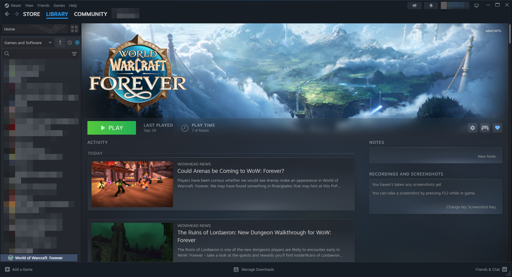

# External Data Sources Plugin for Millennium

A Millennium plugin that adds external data integration for non-Steam games.

The plugin displays RSS or Atom feeds on a game's Activity and the library's What's New, in both Desktop and Big Picture.

It also lets you assign a release date to a non-Steam game for library sorting.




## How to Install

1. Go to the [Releases page](../../releases/latest) and download the latest `io.tsukasa.millennium.external-data-sources.star` file.
2. Place the `.star` file in your Millennium plugin folder.
3. Open your Millennium settings and confirm that **External Data Sources** is listed and enabled.


## How to Use

1. Right-click a non-Steam game and select **Properties** → **External Data Sources**.
2. Enter a fully qualified HTTP or HTTPS URL for an RSS 2.0 or Atom 1.0 feed.
3. Click **Save** to save the settings for the game and refresh the news view.
4. Click **Clear** to remove the source and restore Steam's default behavior.

To set a release date, use the **External Release Date** section on the same page.
The saved date updates library sorting without navigating away from the current page.

Note: You can save exactly one feed per shortcut AppID.

When displaying feed items, the plugin automatically tries to select an image from the feed.
If an item has no image, the plugin uses the game's hero artwork when available. Items without dates appear at the end of the list.

Clicking an article opens it in your default browser or Big Picture's integrated browser.

If a feed refresh fails, the last successful feed items remain visible. The plugin retries on the next background refresh for that feed.

Successfully retrieved feeds are cached for ten minutes by default. In Millennium's plugin settings, you can set a global refresh interval of 10 to 360 minutes and the number of simultaneous background feed fetches (1 to 8). Changing a feed source invalidates its cache.

Per-game feed settings are stored in Millennium's persistent plugin configuration
under `plugins["io.tsukasa.millennium.external-data-sources"].config["<appid>"].feed` in the Millennium `config.json`.

Removing a non-Steam shortcut from the Steam library also removes its configured feed and release date.


## How to Build

To build this plugin, you will require Bun and Node.js:

```sh
bun install --frozen-lockfile
bun run check
bun run test
bun run build
```

Backend regression tests can also be run from the repository root with Lua 5.4:

```sh
lua tests/backend.test.lua
```

Translations are maintained in `resources/locales/<steam-language>.json`.

The build, type-check, test, and development commands generate `resources/locales.json`
for the frontend. While `bun run dev` is running, run `bun run locales` after editing
a language file to refresh the bundle.

Building with `bun run build` packages the plugin as a `.star` file into the `dist` folder.

To install the plugin, copy the `.star` file to your Millennium plugin folder and enable
**External Data Sources** in Millennium.


## Acknowledgements

The following projects were a great inspiration:
- [retrotoolsdev-wq's Game Data Linker](https://github.com/retrotoolsdev-wq/game-data-linker/) for the idea of fetching external data.
- [k0d13's Steam non-Steam Playtimes](https://github.com/k0d13/steam-non-steam-playtimes/) for the initial code to generate and hook a property page.
- Uses [Millennium's PluginTemplate](https://github.com/SteamClientHomebrew/PluginTemplate) as a base for the plugin.
- This project is AI slop. A good chunk of the frontend code was either generated, reviewed or altered with AI tools.
- The generation and translation of the non-English locales were performed with AI tools as well.

Detailed acknowledgements are included in [THIRD_PARTY_NOTICES.md](THIRD_PARTY_NOTICES.md) within the `.star` file.


## FAQ

**Q: Does this plugin support Big Picture mode or the main Library's What's New view?**

Yes, it does! You should see the news feed items on both your "What's New" section as well as your game detail page - in both the desktop client, as well as in Big Picture mode.

**Q: Why is this plugin not available on Millennium's plugin page?**

I built this for my own use. Maintaining a plugin on an officially curated list would be
more commitment than I want to take on. Feel free to fork this code, improve it, and
submit it to Millennium. That's what open source is for.

**Q: Why did you use a clanker? The code sucks!**

As long as desktop applications continue to use web technologies, I have very little shame in generating parts I cannot be bothered to work out myself. It is already a shit stack anyway.

The clanker is really good at drilling into a React application's structure. This vastly accelerates the development process.
